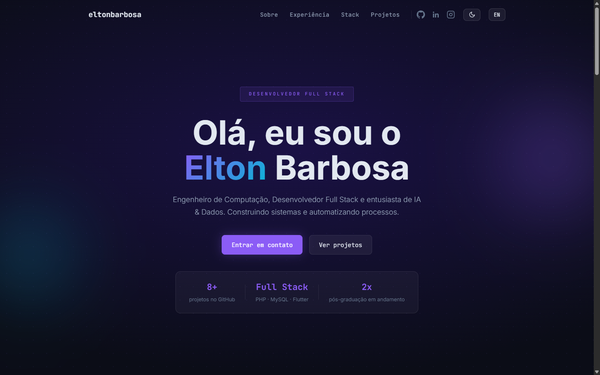

# eltonbarbosaa.github.io

Portfólio pessoal de **Elton Barbosa** — Engenheiro de Computação, Desenvolvedor Full Stack e entusiasta de IA & Dados.

🔗 **Live:** [eltonbarbosaa.github.io](https://eltonbarbosaa.github.io)

<p align="center">
  
  
</p>

## Stack

Site estático, sem build e sem dependências de npm:

- **HTML / CSS / JavaScript** puros
- Fontes [Inter](https://fonts.google.com/specimen/Inter) + [JetBrains Mono](https://fonts.google.com/specimen/JetBrains+Mono) via Google Fonts
- Publicado via **GitHub Pages** (branch `main`, raiz do repositório)

## Recursos

- 🌐 Conteúdo em **PT/EN** com toggle, persistido em `localStorage`
- 🌓 Tema **claro/escuro** com toggle, persistido em `localStorage`
- 📊 Contador de projetos no hero buscado **ao vivo na API do GitHub**
- 🧭 **Scrollspy** — o item do menu da seção atual é destacado ao rolar
- ⬆️ Botão flutuante de **voltar ao topo**
- ♿ Respeita `prefers-reduced-motion`
- 🔍 `robots.txt`, `sitemap.xml`, `og:image` e página **404** customizada

## Estrutura

```
index.html          Estrutura da página (seções: Hero, Sobre, Experiência,
                     Formação, Stack, Projetos)
styles.css           Estilos (tema dark/light via CSS custom properties)
script.js            i18n, tema, scrollspy, stats do GitHub, animações
i18n.js               Dicionário de textos PT/EN
projects.js           Lista de projetos exibidos na seção "Projetos"
404.html              Página de erro customizada
scripts/validate-content.js   Validador de conteúdo (paridade de chaves i18n
                               e formato dos projetos)
```

## Rodando localmente

Não há build step — basta servir os arquivos estáticos:

```bash
python -m http.server 8000
# abra http://localhost:8000
```

Para validar o conteúdo (`i18n.js` e `projects.js`) antes de um commit:

```bash
node scripts/validate-content.js
```
